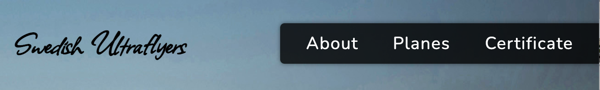
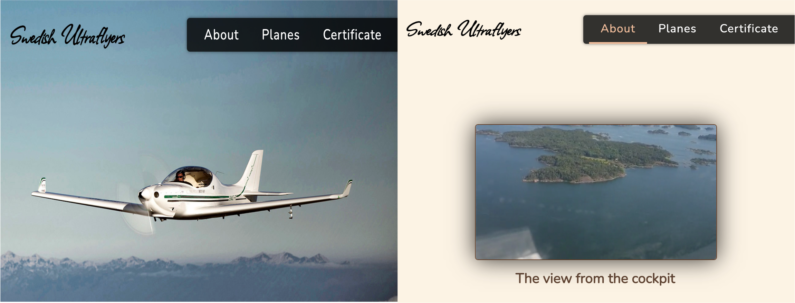

# Swedish Ultraflyers
### Introduction
This Swedish Ultraflyers (SUF) website is about a flight club in Frölunda close to Stockholm that is specialized with ultra light planes (UL). The website provides information about the club, it's school, the prices and the type of ultra light planes that the club owns. The website also gives the posibility to sign up for a test flight and to submit an interest application for pilot certificate programs. Additionally the website provides contact information and social media  netwroks to the users.

The following are users of the website:

- People interested to experience flying on ultralight plane
- The pilots who already have a certificate and want to become a member and use the facilities and airplanes at Swedish Ultraflyers club. 
- People who want to obtain UL certificate or just want to attend the theroy programe.

---

### Am I Responsive 
<figure>
   
  <figcaption>Figure 1. The screenshot from page am I responsive showing that the website is responsive at different screen size </figcaption>
</figure>

---

### Features

##### The navigation bar
  - A fixed navigation bar is designed on the top-right side of the page that sticks to the top of the page when user scrolls the page. 
   - the navigation menu on the top-right has three links to page About, Planes and Certificate, respectively.
   - One navigation link which is the logo is on the top-left and links the user to the homepage.
   <figure>
   
  <figcaption>Figure 2. The navigation bar on the top-right of the picture </figcaption>
</figure>

---
##### The Header

The header contains a logo of the flight club, a navigation bar, and a background picture. The logo contains the club name and sticks to the top left of the header. The background image shows an ultralight plane in the air that gives the visual clue to what the site is about. On ***About*** page, the header has a special feature containing a video on a blank background that is muted and is on autoplay.
<figure>
   
  <figcaption>Figure 3. The header in About page (right) and all other pages (left) </figcaption>
</figure>

---

##### The Homepage with sign up form image 1
The ***homepage*** is presented in the wall picture below as ***image 1*** on the top-left corner. The homepage is the first page that the user sees upon opening the website. Here the user is introduced to what the club offers. The ***signup form*** in homepage gives immediate access to the user to book a test leisure flight at the Swedish Ultraflyers club and  learn more about them. The user can always go back to homepage by clicking on the ***logo (Swedish Ultraflyers)*** on the top-left of the page.

---

##### The thank you page image 2
A page with a thank you message pops up when the ***Lets Fly***  or ***Submit your application*** buttons in ***homepage (image 1)*** and ***Certificate (image H)*** forms, respectively, are pressed. This page is a sort of confirmation that the buttons work and the forms are submitted.

---

##### The terms and conditions page image 3
In the form sections in ***homepage (image 1)*** and ***Certificate (image H)***, the user is provided with a link to terms and conditions that opens up in another tab, and the user can read the terms before ticking on the box. The navbar is also available on this page to easily navigate the user to other pages. 

---

##### The About section images A and B
The user can read about the club On ***About*** page where the first section as shown in ***image A*** and differentiated by color, presents the club's history and its curriculum. In the second section ***image B*** the user is presented with the information about the ***Flight school***  that is also separated by a different color. On the bottom part of the About page, the contact and address information is provided as shown in the yellow part of the ***image B***. to remind here, upon opening the ***About*** page the user also sees a video on muted autoplay as mentioned before.

---

##### The Planes section images C, D and E
The Planes page introduces the user to the types of ultralight planes that the club owns. This page is divided into three sections differentiated by colors. Here the users learn what airplanes they should expect flying with if they are interested in joining as a member or student to flight school. Notice that the sticky navbar stays always on top of the page when scrolling up. 

---

##### The Ceritificate section images F, G and H
The page presents information in different sections separated by colors. On the first top part shown in ***image F*** an introduction to flight training procedure is given to the user followed by a section that gives the general information about prices. As seen in ***image G*** the next section provides prices to book different plane types and is followed by another part where costs are described for those who want to start flight training at the school and become a student. Finally, at bottom of certificate page ***image H*** the user can apply to the school training programs through the ***form***. The form gives the user the option to choose what they want to apply for and pick up a start date. The user has to be above 18 years old to be able to fly with an instructor therefore is asked to provide information on the age so that the club can plan on what program they can start with the specific user based on their age. If the user already has the medical certificate and student permit that are required to be able to fly with an instructor, they can also upload the files in this form. 

---
<figure>
   
  <figcaption>Figure 4. The screenshots of all the pages taken from an iPad screen size</figcaption>
</figure>

---

##### The footer
The footer contains the logo on the left side, the copyright text in the middle, and the SVG icons links to social media are on the right side of the footer that opens up in a new tab.
<figure>
   
  <figcaption>Figure 5. The footer of the website with social media icons</figcaption>
</figure>

---

### Test work
-Checked the sign up form inhomepage and application form in page certificate so that all the validations work. Also when click terms and conditions or on submit button it links the user to terms and conditions and thank you page, respectivly.
- Checked that all the external links open in new tab.
- checked that the site works properly in safari and google chrome.
-Used Chrome DevTools to check out the HTML and its related properties in CSS to improve my code and CSS. Using DevTools I also checked different screen sizes to make the webpage responsive. Later I checked the website on real GlaxyS9, iphone11, desktop screen and 13-inch macbookpro screen.  In addition I used console and fixed couple of errors related to placeholder that I set for date and time input. The placeholder is simply unnecessary for date and time input by removing it the error in console disappears. 
---
### Bugs
#### Reseolved issues
- Render blocking stylesheet (Allison) by changing the link taken from google font with:
```
<link media="print" onload="this.onload=null;this.removeAttribute('media');"
        href="https://fonts.googleapis.com/css2?family=Allison" rel="stylesheet">
```
- The order of submit and terms elements and borders touching for mobile version, the position is swtiched
- The select element in form in certificate page did not get the style when opened in Safari. This is fixed by adding webkit to select in style sheet:
```
select {
    -webkit-appearance: initial;
}
```
---
### Validation 
- The HTML and CSS code is validated by W3C and jogsaw tool, respectively, and no errors are detected on the final version of all the webpages.
- The accesibility is controlled by lighthouse for both mobile and desktop and the reports are as follow: 
<figure>
   
  <figcaption>Figure 6. The summary report generated by Lighthouse. The top and bottom report are generated for desktop and mobile, respectively. </figcaption>
</figure>

---
 - The accessibility for users with impairments is checked by WAVE evaluation tools (https://wave.webaim.org/), and the report shows no error. There is an alert when evaluating the page "About" that is related to the video. Since there is only music without words on the video the caption and transcript addition is skipped therefore the alerts can be ignored. 
 <figure>
   
  <figcaption>Figure 7. The summary report generated by Wave validation tool</figcaption>
</figure>

---
### Deployment
I deplyed my website to GitHub page through the following steps: 
- First used git push command to push my last update to GitHub
- In my GitHub account,  my project repository HCPP-1 and setting > pages, I used main branch as source and saved it. Then the page provided me with alink to my website.
---
### Acknowledgement
- I used the same code as the one used for the Love Running project for my social media links.
- The image used in the header is taken from the following: www.aopa.org
- I also like to appreciate all the time and pieces of advice given by Maria Hynes.

