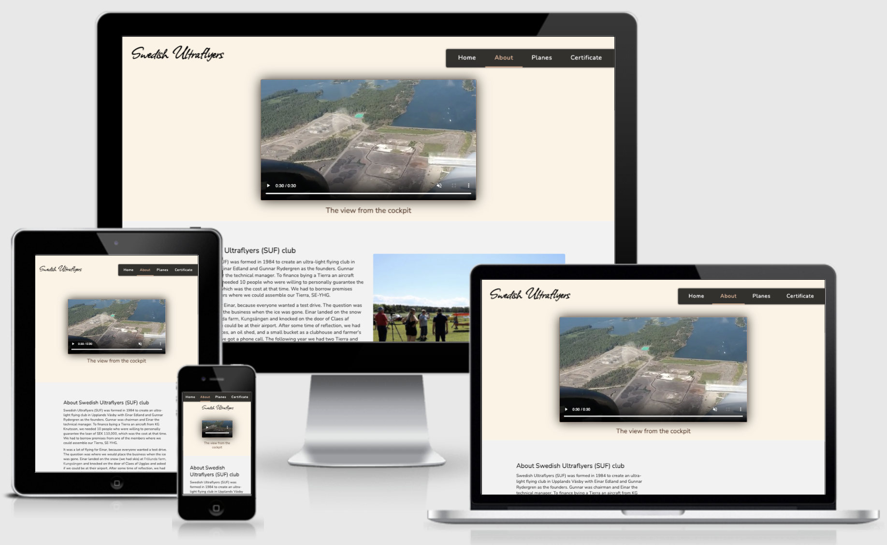

# Swedish Ultraflyers
### Introduction
This Swedish Ultraflyers (SUF) website is about a flight club in Frölunda close to Stockholm that is specialized in ultralight planes (UL). I am an active member of the club and have a great passion for flying airplanes. Currently, the club has a website in the Swedish language (https://www.frolundaflygfalt.se/) and does not have the best design, see ***figure 1***. People looking for the best flight school or flight club may not know Swedish language. For example, people visit Stockholm during summertime, and they want to enjoy the scenery flying over the Baltic sea and archipelago and need to find information about the club in English. Also, pilots from other countries sometime land at the club's airport. Therefore, I decided to make a website in the English language with a better design for the club so that everyone mentioned above can easily access information about the club.
<figure>
   
  <figcaption><strong>Figure 1.</strong> The screenshot of different pages of the Swedish Ultraflyers website in the Swedish language.</figcaption>
</figure>


 The website provides information about the club, its school, the prices, and the type of ultralight planes that the club owns. The users can sign up for a test flight and submit an interest application for the pilot certificate programs. Additionally, the website provides contact information and social media networks to the users.The following are users of the website:
- People interested to experience flying on an ultralight plane
- The pilots who already have a certificate and want to become a member and use the facilities or airplanes at the Swedish Ultraflyers club. 
- People who want to obtain a UL certificate or want to attend the theory program.

---

### Am I Responsive 
<figure>
   
  <figcaption><strong>Figure 2.</strong> The screenshot from the am I responsive website showing that the website is responsive at different screen size </figcaption>
</figure>

---

### Features

##### The navigation bar
  - A fixed navigation bar is positioned on the right side of the page with a 4% distance from the top, see ***figure 3 left***. This is because I liked it this way rather than sticking the navbar to the top for medium and large screen sizes. The navbar sticks to this position when the user scrolls the page. 
  - The navigation bar position moves to top (0%) above the logo and sticks there at screen sizes 620px and down when scrolling up, see ***figure 3 right***. 
   - The navigation menu has four links to pages Home, About, Planes, and Certificate.
   - The logo in the header and footer also links to the Homepage.
   <figure>
   
  <figcaption><strong>Figure 3.</strong> The picture to the left shows navigation bar one large and medium size scree and the picture to the left shows the navigation bar at screen sizes below 620px. </figcaption>
</figure>

---
##### The Header

The header has a logo of the flight club, a navigation bar, and a background picture, see ***figure 4 left***. The logo is the club name and sits at the top left of the header. The background image shows an ultralight plane in the air giving the clue on what the site is about. On ***About*** page, see ***figure 4 right*** the header has a  feature presenting a video on a blank background that is muted and is on autoplay.
<figure>
   
  <figcaption><strong>Figure 4.</strong> The picture on the right shows the header in About page and the picture on the left shows the header on all other pages</figcaption>
</figure>

---

##### Homepage 
- The first section of the homepage gives a brief introduction to the Swedish Ultraflyers and invites the user to have an experience of flying on an ultralight plane, see ***figure 5 left***.
- The second section is a ***sign up form*** and give immediate access to the user to book a test flight at the Swedish Ultraflyers club and meet with the club's instructors see ***figure 5 right***. 
<figure>
   
  <figcaption><strong>Figure 5.</strong> The homepage contents showing a form on the right and the text on the left </figcaption>
</figure>

---

##### About 
 - The first section of this page he club's history and its curriculum, picture on the top with grey background color, see ***figure 6 left***. 
 - The second section presents the information about the ***Flight school***, picture on the top with light green color, see ***figure 6 right***.
- At the bottom part of the About page, the contact and address information is provided on a yellow background, see ***figure 6 bottom***.
 <figure>
   
  <figcaption><strong>Figure 6.</strong> The page About's contents showing the first section on the left picture, the second section on the right picture and the contact section at the bottom</figcaption>
</figure>

---

##### Planes 
The Planes page introduces the user to the types of ultralight planes that the club owns. This page is divided into three sections differentiated by colors, ***see figure 7***. Here the users learn what airplanes they should expect flying with if they are interested in joining as a club member or student to flight school. 
<figure>
   
  <figcaption><strong>Figure 7.</strong> The page plane's contents showing the first section on the left picture introducing to Dynamic plane, the second section in the middile presents Skylane plane and the picture to the right is about about the seaplane</figcaption>
</figure>

---

##### Ceritificate 
- The first section is an introduction to flight training procedures followed by information about prices for users who want to become a club member, see ***figure 8 left***. 

- The second section provides prices to book different plane types followed by training costs for those who want to start flight training at the club's school, see ***figure 8 middle***. 

- Finally, the third section of the certificate page is a ***form*** where the user can apply to the school training programs, see ***figure 8 right***. The form gives the users an option to choose what they want to apply for and pick up a start date. The user should be above 18 years old to fly with an instructor and provides information on the age so that the club can plan on what program they can start based on the user's age. If the user already has the medical certificate and student permit, which are required to fly with an instructor, they can also upload the files in this form. 


<figure>
   
  <figcaption><strong>Figure 8.</strong> The page certificate's contents showing the first section on the left, the second section in the middle, and the form section on the left.</figcaption>
</figure>

---


##### Thank you 
A page with a thank you message pops up when the ***Lets Fly***  or ***Submit your application*** buttons in ***homepage*** and page ***Certificate***, respectively, are pressed. This page gives a  confirmation to users that the buttons work and the form is submitted, see ***figure 9 top***.


##### Terms and conditions 
In the form sections in ***homepage*** and page ***Certificate***, the user is provided with a link to read terms and conditions that open up in another tab if it is clicked. The users can read the terms before ticking the box,see ***figure 9 bottom*** . 

<figure>
   
  <figcaption><strong>Figure 9.</strong> The message in confirmation page at the top. The content of page terms and conditions at the bottom.</figcaption>
</figure>


---

##### The footer
The footer contains the logo on the left side, the copyright text in the middle, and the SVG icons links to social media are on the right side of the footer, see ***figure 10***. The logo and social media have hover pseudoclass and change color when users hovers on them. The social media open up in a new tab. The logo at footer opens the homepage if it is clicked by users.
<figure>
   
  <figcaption><strong>Figure 10.</strong> The footer of the website with social media icons and logo</figcaption>
</figure>

---

### Test work
- Checked the signup form on the homepage and the application form on the page certificate and confirmed all the validations work. Also controlled the links to terms and conditions and confirmation page after submission open in a new tab.
- Checked that all the external links open in a new tab.
- Checked that the site works properly in safari and google chrome.
- I used Chrome DevTools to check out the HTML and its related properties in CSS to improve my code and CSS. Using DevTools I also checked different screen sizes to make the webpage responsive. 
- I also checked the website on real GlaxyS9, iphone11, desktop screen, and 13-inch MacBook Pro screen. 
- I used the console in DevTools to find out errors, there was no error detected there.
- The contrast checker (https://webaim.org/resources/contrastchecker/) was used to make sure that the contrast between foreground and background passes the criteria for visually impaired individuals.
---
### Bugs
#### Reseolved issues
- The render blocking stylesheet (Allison) issue was generated by lighthouse when running for desktop. This issue is fixed by changing the link taken from google font as follow:
```
<link media="print" onload="this.onload=null;this.removeAttribute('media');"
        href="https://fonts.googleapis.com/css2?family=Allison" rel="stylesheet">
```
- The order of submit and terms elements was changed for screen size 620px and down so that  the users first see terms and conditditions and then the submit button. I did this using order property as follow:
```
#action-term.two-column-row .submit {
    width: 100%;
    margin-top: 25px;
    order: 2;
  }
```
- To increase the  loading speed when the site open up on mobiles I reduced the size of all pictures used in the site. Then in the HTML file, I nested the ***img*** element in the ***picture*** element and give it the target screen size in the ***source*** that improved the Lighthouse performance score.
```
<picture>
<source media="(max-width:620px)" srcset="assets/images/se-vod-copy.jpg">

</picture>
```

- The hero image in the header was too large for screen sizes 620px and down. I reduced the picture size and in this case since the picture was added as URL value to background property in CSS, I set another background for media query 620px and down as follow:

  - For large and medium screen size
    ```

    header #hero-image {
    background: url(../images/header-bg.jpg);
    }
    ```
  - For screen size 620px and down
    ```
    header #hero-image {
    background: url(../images/header-bg-copy.jpg);
    }
    ```
- The select element in form in certificate page did not adopt the style when opened in Safari. This is fixed as follow:
```
select {
    -webkit-appearance: initial;
}
```
- The date and time input did not adopt style when opened in safari on mobile. This is fixed by adding the following to input:
```
input[type=date],
input[type=time] {
  -webkit-appearance: textfield;
  -moz-appearance: textfield;
}
```
---
### Validation 
- The HTML and CSS code is validated by W3C HTML and CSS validation service, respectively, and no error was detected on the final version of all the HTML pages and CSS stylesheet, see ***figure 11***.
  
<figure>
   
  <figcaption><strong>Figure 11.</strong> The  report generated by W3C HTML and CSS validation tool confirming that no error was found on my HTML and CSS files. </figcaption>
</figure>

- The accessibility is tested by the Lighthouse too for mobile and desktop. A score of 100 is generated for  accessibility, see ***figure 12***: 

<figure>
   
  <figcaption><strong>Figure 12.</strong> The summary report generated by Lighthouse. The top and bottom report are generated for desktop and mobile, respectively. </figcaption>
</figure>

---
 - The accessibility for users with impairment is checked by WAVE evaluation tool (https://wave.webaim.org/), and the report showed no error for all pages, see ***figure 13***. 
 <figure>
   
  <figcaption><strong>Figure 13.</strong> The summary report generated by Wave validation tool</figcaption>
</figure>

---
### Deployment
I deployed my website to the GitHub page through the following steps: 
- First used the git push command to push my last update to GitHub
- In my GitHub account,  my project repository HCPP-1 and setting > pages, I used the main branch as the source and saved it. Then the page provided me with a link to my website.
---
### Credits
- #### Content
  - The same code as the one used for the Love Running project is used for social media links and animation on the header hero image.
  - The social media icons are from Font Awesome
  - The material icons on the page certificate are taken from Google icons.
  - The text in this website is the partial translation from the Swedish to the English language of the text on the Swedish Ultraflyers website.
  - I used https://mycolor.space/ to find matching shades for different sections of my website.

- #### Learning material
  - I used https://www.w3schools.com/ and https://developer.mozilla.org/ to read and learn more on how to write HTML and CSS.
- #### Pictures
  - The image used in the header is taken from: https://www.aopa.org/.
  - The pictures used in the body of the website are sent to me by Carl Berglund,  the manager of the Swedish Ultraflyer club. He provided the pictures used on the website and permitted me to use their content on my website.
  

At last but not least I want to appreciate all the time and pieces of advice given by Maria Hynes.

